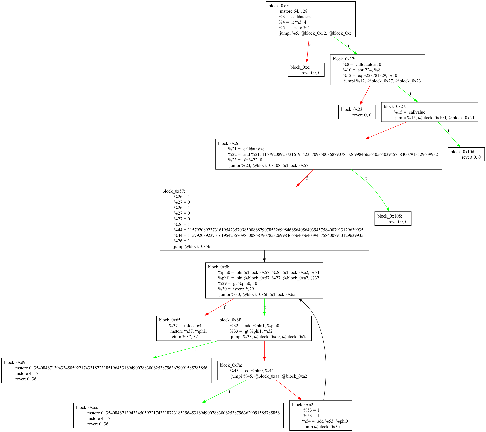

# (wip) bytecode venom transpiler
_Currently limited support, but shows early signs of life_

Input raw EVM bytecode and get Venom IR out. 

## Motivation
I was working on my own compiler alternative to Solidity during the autumn of 2024, but didn't have time to fully prioritize it and then lost some interest in it. During Christmas Holidays I saw this tweet from one of the [Vyper and Venom developers](https://x.com/harkal/status/1870054989990666584) where he teased something like this, but it never got spoken about again and so I got curious to implement it myself.

## Known issues
- The placement of phi functions is not fully implemented and also not fully working. There is some basic support.
- There will be edges cases in case of `CODECOPY` which we don't correctly cover. Or more generally, we don't model model memory or storage atm which could cause incorrect transpiled code.

## Example
First install what you need to run this
```bash
pip3 install -r requirements.txt
pip3 install -e .
```

```bash
> bytecode_transpiler --optimizer "codesize" --bytecode "6080604052600436101561001257600080fd5b60003560e01c63c0734b111461002757600080fd5b3461010d5760007ffffffffffffffffffffffffffffffffffffffffffffffffffffffffffffffffc36011261010857600160005b600a82111561006f57602090604051908152f35b8181018091116100d957907fffffffffffffffffffffffffffffffffffffffffffffffffffffffffffffffff81146100aa576001019061005b565b7f4e487b7100000000000000000000000000000000000000000000000000000000600052601160045260246000fd5b7f4e487b7100000000000000000000000000000000000000000000000000000000600052601160045260246000fd5b600080fd5b600080fd"

608060405236600310610010575f5ffd5b5f3560e01c63c0734b1114610023575f5ffd5b346100a45736600319015f136100a05760015f5b818183838593600b1161005557505050509050604051908152602090f35b935001918290111561007857505050634e487b7160e01b5f52601160045260245ffd5b19610093575050634e487b7160e01b5f52601160045260245ffd5b5f19509060010190610037565b5f5ffd5b5f5ffd
```

```bash
> bytecode_transpiler --optimizer "gas" --bytecode "6080604052600436101561001257600080fd5b60003560e01c63c0734b111461002757600080fd5b3461010d5760007ffffffffffffffffffffffffffffffffffffffffffffffffffffffffffffffffc36011261010857600160005b600a82111561006f57602090604051908152f35b8181018091116100d957907fffffffffffffffffffffffffffffffffffffffffffffffffffffffffffffffff81146100aa576001019061005b565b7f4e487b7100000000000000000000000000000000000000000000000000000000600052601160045260246000fd5b7f4e487b7100000000000000000000000000000000000000000000000000000000600052601160045260246000fd5b600080fd5b600080fd"

608060405236600310610010575f5ffd5b5f3560e01c63c0734b1114610023575f5ffd5b3461011357367ffffffffffffffffffffffffffffffffffffffffffffffffffffffffffffffffc015f1361010f5760015f5b818183838593600b1161007357505050509050604051908152602090f35b93500191829011156100af575050507f4e487b71000000000000000000000000000000000000000000000000000000005f52601160045260245ffd5b196100e35750507f4e487b71000000000000000000000000000000000000000000000000000000005f52601160045260245ffd5b7fffffffffffffffffffffffffffffffffffffffffffffffffffffffffffffffff509060010190610055565b5f5ffd5b5f5ffd
```

That will also generate the plot of the Venom IR that was used to transpile the bytecode into `./output`.




## Debugging the IR
There is a simple bash script in the root of this repo that can be used to view the IR of Vyper contract and also compile raw Venom IR. Useful for debugging.

```bash
# Generates the Venom IR output
./venom.sh generate [vyper file]
# Compiles the Venom IR output
./venom.sh compile [venom file]
```

## Resources
- [Wikipedia article on SSA](https://en.wikipedia.org/wiki/Static_single-assignment_form)
- [Venom IR readme](https://github.com/vyperlang/vyper/blob/master/vyper/venom/README.md)
- [Presetnation on Rattle](https://www.trailofbits.com/documents/RattleRecon.pdf) which converts bytecode into SSA form. Some ideas are applicable here. It's built on top of this [paper](https://c9x.me/compile/bib/braun13cc.pdf) which I should take more ideas from.
